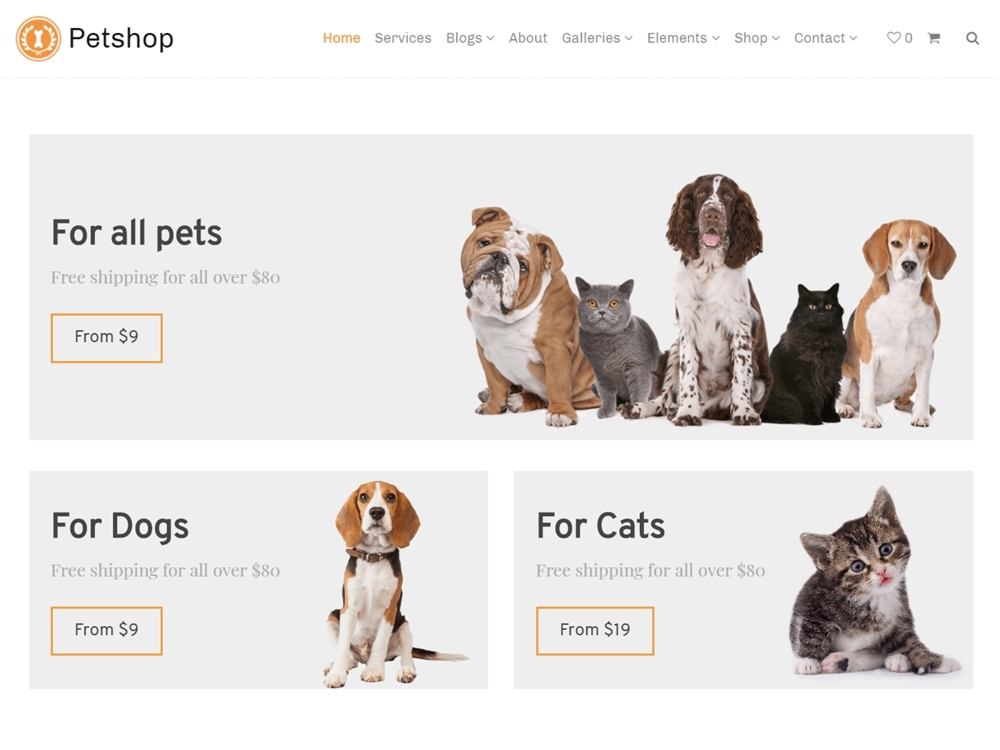

# Codi 3 Challenge 10

## WP WooCommerce Theme

* 3 Product sections
  * 1 Wide width
  * 2 Half width
* Each has:
  * A title
  * A sentence
  * A button with a price

The price in the button is the price of the product of that section that is lowest.

